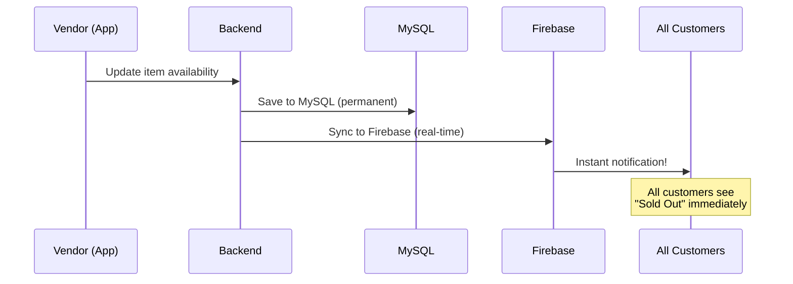
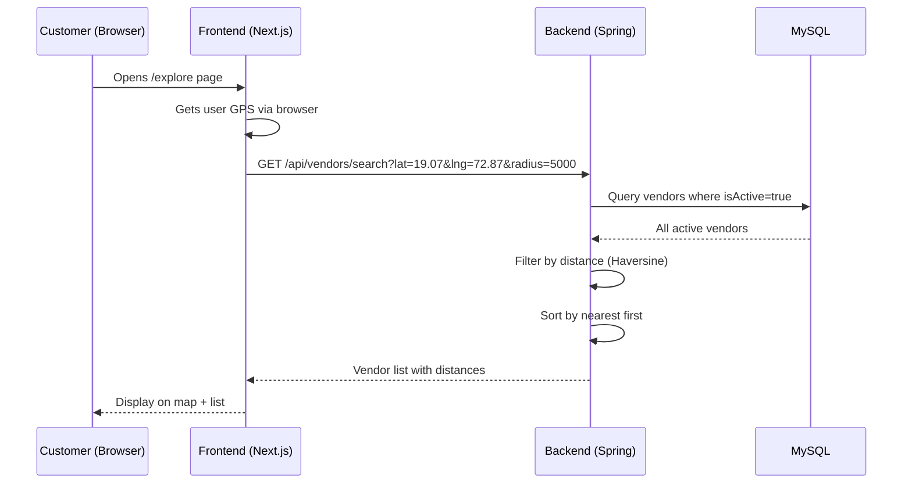
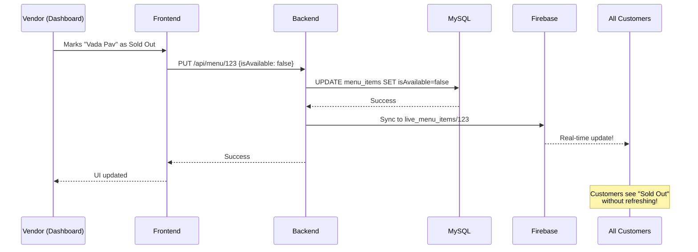
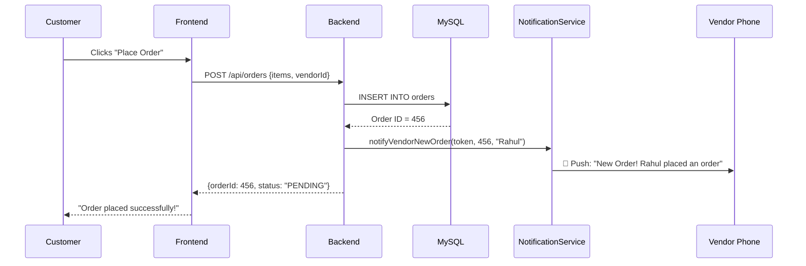

# 🍽️ StreetBite - Complete Project Documentation

> A comprehensive breakdown of every feature, service, and database connection in simple language.

---

## 📖 Table of Contents

1. [What is StreetBite?](#what-is-streetbite)
2. [Why is StreetBite Needed?](#why-is-streetbite-needed)
3. [Technology Stack Overview](#technology-stack-overview)
4. [Database Architecture](#database-architecture)
5. [Backend Services - Detailed Breakdown](#backend-services---detailed-breakdown)
6. [Frontend Pages - Detailed Breakdown](#frontend-pages---detailed-breakdown)
7. [Data Flow Examples](#data-flow-examples)
8. [Security & Authentication](#security--authentication)
9. [API Endpoints Reference](#api-endpoints-reference)

---

## What is StreetBite?

**StreetBite** is a full-stack web application that connects hungry customers with local street food vendors. Think of it as "Google Maps meets Zomato, but exclusively for street food stalls."

### The Core Concept
```
┌─────────────────┐         ┌─────────────────┐
│    CUSTOMER     │◀────────▶│     VENDOR      │
│  Finds vendors  │         │ Manages stall   │
│  Views menus    │         │ Gets orders     │
│  Writes reviews │         │ Tracks analytics│
└─────────────────┘         └─────────────────┘
              ▲                     ▲
              │                     │
              ▼                     ▼
        ┌─────────────────────────────────┐
        │           ADMIN                 │
        │   Manages entire platform       │
        └─────────────────────────────────┘
```

### Three Types of Users

| User Type | What They Can Do |
|-----------|------------------|
| **Customer** | Browse vendors, view menus, leave reviews, save favorites, get directions |
| **Vendor** | Manage menu items, view analytics, create promotions, respond to reviews |
| **Admin** | Manage all vendors, view system analytics, handle user accounts |

---

## Why is StreetBite Needed?

### The Problem
1. **Customers struggle** to find authentic street food vendors near them
2. **Vendors have no online presence** - they rely on walk-by traffic only
3. **No reliable reviews** for street food stalls like restaurants have
4. **Customers can't check** if a vendor is open or what they serve today

### The Solution
StreetBite solves these problems by:
- 📍 **Location-based search** - Find vendors within your radius
- 📋 **Digital menus** - See what's available before going
- ⭐ **Review system** - Trust real customer ratings
- 📊 **Analytics for vendors** - Help vendors grow their business
- 🔔 **Real-time updates** - Know when vendors are open/closed

---

## Technology Stack Overview

### Frontend (What Users See)
```
┌─────────────────────────────────────────────────┐
│              NEXT.JS 16 (React 19)              │
├─────────────────────────────────────────────────┤
│  TypeScript    │  Tailwind CSS  │  Radix UI    │
│  (Type-safe)   │  (Styling)     │  (Components)│
├─────────────────────────────────────────────────┤
│     Firebase Client SDK (for real-time sync)   │
└─────────────────────────────────────────────────┘
```

### Backend (Server Logic)
```
┌─────────────────────────────────────────────────┐
│            SPRING BOOT 3.2.0 (Java 21)         │
├─────────────────────────────────────────────────┤
│  Controllers   │  Services      │  Repositories│
│  (API routes)  │  (Logic)       │  (Database)  │
├─────────────────────────────────────────────────┤
│  JWT Security  │  BCrypt        │  Caffeine    │
│  (Auth tokens) │  (Passwords)   │  (Caching)   │
└─────────────────────────────────────────────────┘
```

---

## Database Architecture

StreetBite uses a **Hybrid Database System** with two databases working together:

### Why Two Databases?

```
┌───────────────────────────────────────────────────────────────┐
│                     DATABASE STRATEGY                          │
├─────────────────────────────┬─────────────────────────────────┤
│         MySQL               │       Firebase Firestore        │
├─────────────────────────────┼─────────────────────────────────┤
│ ✅ Primary Data Storage     │ ✅ Real-Time Updates            │
│ ✅ Relational Data          │ ✅ Instant Sync Across Users    │
│ ✅ Complex Queries          │ ✅ Push Notifications           │
│ ✅ Transactions             │ ✅ Authentication               │
├─────────────────────────────┼─────────────────────────────────┤
│ STORES:                     │ STORES:                         │
│ • Users                     │ • Live vendor locations         │
│ • Vendors                   │ • Live menu availability        │
│ • Menu Items                │ • Live vendor status            │
│ • Orders                    │ • Push notification tokens      │
│ • Reviews                   │                                 │
│ • Promotions                │                                 │
│ • Analytics Events          │                                 │
│ • Geocode Cache             │                                 │
└─────────────────────────────┴─────────────────────────────────┘
```

### How They Work Together

**Example: Vendor marks item as "Sold Out"**



### Why Each Database?

| Use Case | MySQL | Firebase | Why? |
|----------|-------|----------|------|
| User accounts | ✅ | | Secure, permanent storage with relationships |
| Menu items | ✅ | | Complex queries, price calculations |
| Live availability | | ✅ | Instant updates without page refresh |
| Vendor location | ✅ (backup) | ✅ (live) | Real-time GPS tracking on map |
| Push notifications | | ✅ | Firebase Cloud Messaging integration |
| Order history | ✅ | | Relational data, reports, analytics |

---

## Backend Services - Detailed Breakdown

The backend has **16 services**, each handling a specific responsibility:

---

### 1️⃣ AuthController + UserService
**Purpose**: Handle user registration, login, and authentication

```
📁 AuthController.java (253 lines)
📁 UserService.java (31 lines)
```

**What it does:**
- **Register** - Creates new user accounts (customer/vendor/admin)
- **Login** - Verifies credentials, returns JWT token
- **Forgot Password** - Sends reset email with token
- **Reset Password** - Updates password using token

**How authentication works:**
```
1. User enters email + password
2. Backend checks if email exists in MySQL
3. BCrypt compares password hash
4. If match → Generate JWT token (valid 24 hours)
5. Return token to frontend
6. Frontend stores token in localStorage
7. Every API request includes token in header
```

**Database**: MySQL (`users` table)

**Why BCrypt?** 
- Passwords are never stored as plain text
- BCrypt is a one-way hash (can't reverse it)
- Even if database is hacked, passwords are safe

---

### 2️⃣ VendorService
**Purpose**: Manage vendor profiles and CRUD operations

```
📁 VendorService.java (59 lines)
```

**What it does:**
- `saveVendor()` - Create or update vendor profile
- `getAllVendors()` - Get all vendors (for admin)
- `getActiveVendors()` - Get only active vendors (for customers)
- `getVendorById()` - Get single vendor details
- `deleteVendor()` - Delete vendor AND all related data

**Cascade Delete Logic:**
```java
// When deleting a vendor, we must also delete:
reviewRepository.deleteByVendorId(id);    // All reviews
favoriteRepository.deleteByVendorId(id);  // All favorites
orderRepository.deleteByVendorId(id);     // All orders
vendorRepository.deleteById(id);          // Finally, the vendor
```

**Database**: MySQL (`vendors` table)

---

### 3️⃣ VendorSearchService
**Purpose**: Find vendors near a GPS location

```
📁 VendorSearchService.java (66 lines)
```

**What it does:**
- Takes customer's GPS coordinates (lat, lng) and search radius
- Finds all active vendors within that radius
- Sorts by distance (closest first)

**The Math - Haversine Formula:**
This is the formula to calculate distance between two GPS points on Earth:
```
distance = 2 * R * arcsin(√(sin²(Δlat/2) + cos(lat1) * cos(lat2) * sin²(Δlng/2)))
```
Where R = 6,371 km (Earth's radius)

**Caching:**
```java
@Cacheable(value = "vendorSearch", key = "#lat + '_' + #lng + '_' + #radiusMeters")
```
This caches search results so the same search doesn't hit the database again.

**Database**: MySQL (`vendors` table)

---

### 4️⃣ MenuService
**Purpose**: Manage menu items for vendors

```
📁 MenuService.java (60 lines)
```

**What it does:**
- Add new menu items
- Update existing items (price, availability, description)
- Delete menu items
- Get all items for a vendor

**Database**: MySQL (`menu_items` table)

---

### 5️⃣ OrderService
**Purpose**: Handle customer orders

```
📁 OrderService.java (89 lines)
```

**What it does:**
- `createOrder()` - Creates order + notifies vendor
- `updateOrderStatus()` - Updates status + notifies customer
- `getOrdersByUser()` - Customer order history
- `getOrdersByVendor()` - Vendor incoming orders

**Order Status Flow:**
```
PENDING → ACCEPTED → READY → COMPLETED
              ↓
          CANCELLED
```

**Notification Integration:**
When order status changes, the service automatically sends push notifications:
```java
// Example: When vendor accepts order
notificationService.notifyCustomerOrderUpdate(token, orderId, "ACCEPTED");
// Customer gets push: "✅ Order Accepted! Your order has been accepted by the vendor."
```

**Database**: MySQL (`orders`, `order_items` tables)

---

### 6️⃣ ReviewService
**Purpose**: Handle customer reviews and ratings

```
📁 ReviewService.java (25 lines)
```

**What it does:**
- Create new review (with rating 1-5)
- Update existing review
- Delete review
- Get all reviews for a vendor

**Database**: MySQL (`reviews` table)

---

### 7️⃣ GeocodingService
**Purpose**: Convert addresses to GPS coordinates

```
📁 GeocodingService.java (92 lines)
```

**What it does:**
- Takes a text address like "Mumbai, India"
- Returns GPS coordinates (19.0760, 72.8777)

**Three-Layer System:**
```
1. Check MySQL Cache → Found? Return cached coordinates
                    ↓
2. Call Google Maps API → Success? Save to cache, return
                    ↓
3. Fallback → Generate deterministic fake coordinates based on address hash
```

**Why caching?**
- Google Maps API costs money per request
- Same address always gives same result
- Cache saves money and speeds up response

**Database**: MySQL (`geocode_cache` table)

---

### 8️⃣ AnalyticsService
**Purpose**: Track and report vendor performance metrics

```
📁 AnalyticsService.java (133 lines)
```

**What it tracks:**
- Profile views (how many people viewed vendor page)
- Direction clicks (how many asked for directions)
- Menu interactions (how many viewed menu items)
- Call clicks (how many tapped to call)

**What it calculates:**
- Total revenue from orders
- Total orders count
- Active customers (unique buyers)
- Average rating
- Top 5 popular menu items

**7-Day Analytics:**
```java
LocalDateTime sevenDaysAgo = LocalDateTime.now().minusDays(7);
long profileViews = analyticsRepository.countEventsByVendorAndTypeSince(
    vendorId, "VIEW_PROFILE", sevenDaysAgo);
```

**Database**: MySQL (`analytics_events` table)

---

### 9️⃣ NotificationService
**Purpose**: Send push notifications via Firebase Cloud Messaging

```
📁 NotificationService.java (177 lines)
```

**What it does:**
- `sendToToken()` - Send to one device
- `sendToMultipleTokens()` - Send to multiple devices
- `sendToTopic()` - Send to all subscribers of a topic
- `subscribeToTopic()` - Add devices to a topic
- Helper methods for order notifications

**Pre-built Notification Templates:**
```java
// For vendors when new order comes:
"🆕 New Order!"
"[CustomerName] placed an order. Tap to view details."

// For customers when order status changes:
"✅ Order Accepted!"   → "Your order has been accepted by the vendor."
"🎉 Order Ready!"      → "Your order is ready for pickup!"
"✨ Order Completed"   → "Thank you! Hope you enjoyed your meal."
"❌ Order Cancelled"   → "Your order has been cancelled."
```

**Database**: Firebase Cloud Messaging (external service)

---

### 🔟 RealTimeSyncService
**Purpose**: Sync data to Firebase for instant updates

```
📁 RealTimeSyncService.java (90 lines)
```

**What it syncs:**
- Menu item availability → `live_menu_items` collection
- Vendor status (online/offline) → `live_vendors` collection
- Vendor GPS location → `live_vendors` collection

**Why needed?**
When a vendor marks an item as "sold out", all customers viewing that menu see it update instantly WITHOUT refreshing the page.

**Fail-safe design:**
```java
} catch (Exception e) {
    System.err.println("Failed to sync to Firebase: " + e.getMessage());
    // Don't throw - allow MySQL operation to succeed even if Firebase sync fails
}
```
If Firebase fails, the main data is still saved to MySQL.

**Database**: Firebase Firestore (`live_menu_items`, `live_vendors` collections)

---

### 1️⃣1️⃣ GamificationService
**Purpose**: Award XP, calculate levels, maintain leaderboard

```
📁 GamificationService.java (140 lines)
```

**XP Rewards:**
| Action | XP Earned |
|--------|-----------|
| Daily Login | 50 XP |
| Complete Challenge | 50 XP |
| Win Game | 100 XP |
| Community Post | 10 XP |

**Level Calculation:**
```
Level = (1 + √(1 + 0.08 × XP)) / 2
```

**Streak System:**
- Login on consecutive days = streak increases
- Miss a day = streak resets to 1
- Streak gives bonus rewards

**Leaderboard:**
```java
return userRepository.findTop10ByRoleOrderByXpDesc(User.Role.USER);
// Returns top 10 users sorted by XP
```

**Database**: MySQL (`users` table - xp, level, streak, lastCheckIn columns)

---

### 1️⃣2️⃣ ZodiacService (Foodtaar)
**Purpose**: Fun personalized food recommendations based on zodiac sign

```
📁 ZodiacService.java (143 lines)
```

**What it provides:**
- Daily food prediction based on zodiac
- Lucky dish of the day
- Lucky time to eat
- Daily food challenge

**Example for Aries:**
```
Prediction: "Spicy food is your best friend today."
Lucky Dish: "Vada Pav"
Challenge: "Try something spicy 🌶"
Lucky Time: "3:45 PM"
```

**How predictions are chosen:**
```java
int dayOfYear = LocalDate.now().getDayOfYear();
int signIndex = Math.abs(zodiacSign.hashCode());
// Deterministic: Same sign on same day = same prediction
```

**Database**: MySQL (`users` table - zodiacSign column)

---

### 1️⃣3️⃣ EmailService
**Purpose**: Send password reset emails

```
📁 EmailService.java (38 lines)
```

**What it does:**
- Sends password reset link via Gmail SMTP
- Link contains unique token valid for 15 minutes

**External Service**: Gmail SMTP (configured in application.properties)

---

### 1️⃣4️⃣ PromotionService
**Purpose**: Manage vendor promotions and offers

```
📁 PromotionService.java (41 lines)
```

**Promotion Types:**
- `PERCENTAGE` - 20% off
- `FIXED_AMOUNT` - ₹50 off
- `BUY_ONE_GET_ONE` - BOGO deals

**Database**: MySQL (`promotions` table)

---

### 1️⃣5️⃣ UserDeviceService
**Purpose**: Track user devices for push notifications

```
📁 UserDeviceService.java (67 lines)
```

**What it does:**
- Store FCM (Firebase Cloud Messaging) tokens for each device
- One user can have multiple devices (phone + tablet)
- When sending notification, send to all user's devices

**Database**: MySQL (`user_devices` table)

---

### 1️⃣6️⃣ VendorStatsService
**Purpose**: Calculate vendor statistics

```
📁 VendorStatsService.java (95 lines)
```

**What it calculates:**
- Total revenue
- Total orders
- Average order value
- Customer retention rate
- Peak hours

**Database**: MySQL (queries across multiple tables)

---

## Frontend Pages - Detailed Breakdown

### Customer-Facing Pages

| Page | Path | Purpose |
|------|------|---------|
| Home | `/` | Landing page with search and featured vendors |
| Explore | `/explore` | Map view with nearby vendors |
| Vendors | `/vendors` | List of all vendors |
| Vendor Detail | `/vendors/[id]` | Single vendor page with menu |
| Sign In | `/signin` | Customer/Vendor login |
| Sign Up | `/signup` | Registration page |
| Profile | `/profile` | User profile and settings |
| Offers | `/offers` | Active promotions and deals |

### Vendor Dashboard Pages

| Page | Path | Purpose |
|------|------|---------|
| Dashboard Home | `/vendor` | Overview with key metrics |
| Menu Management | `/vendor/menu` | Add/edit/delete menu items |
| Analytics | `/vendor/analytics` | Performance charts and stats |
| Promotions | `/vendor/promotions` | Create and manage offers |
| Settings | `/vendor/settings` | Business profile settings |

### Admin Dashboard Pages

| Page | Path | Purpose |
|------|------|---------|
| Admin Home | `/admin` | System overview |
| Vendor Management | `/admin/vendors` | Approve/suspend vendors |
| System Analytics | `/admin/analytics` | Platform-wide statistics |

---

## Data Flow Examples

### Example 1: Customer Finds Nearby Vendors



### Example 2: Vendor Updates Menu Item



### Example 3: Customer Places Order



---

## Security & Authentication

### Password Security

```
User enters: "mypassword123"
                ↓
BCrypt hashes: "$2a$10$N9qo8uLOickgx2ZMRZoMy..."
                ↓
Stored in database (cannot be reversed)
                ↓
On login: BCrypt.matches("mypassword123", hash) → true/false
```

### JWT Authentication

```
┌─────────────────────────────────────────────────────────────┐
│                        JWT TOKEN                             │
├───────────────────┬─────────────────┬───────────────────────┤
│      HEADER       │     PAYLOAD     │      SIGNATURE        │
├───────────────────┼─────────────────┼───────────────────────┤
│ {                 │ {               │                       │
│   "alg": "HS256", │   "email": "...",│  HMACSHA256(         │
│   "typ": "JWT"    │   "userId": 1,  │    header + payload, │
│ }                 │   "role": "USER",│    secretKey        │
│                   │   "exp": 17...  │  )                   │
│                   │ }               │                       │
└───────────────────┴─────────────────┴───────────────────────┘
```

### API Security Flow

```
1. User logs in → Gets JWT token
2. Frontend stores token in localStorage
3. Every API call includes: Authorization: Bearer <token>
4. Backend JwtRequestFilter checks token:
   - Is token valid? (not expired, correct signature)
   - Extract userId, role from token
   - Attach to request context
5. Controller can access: request.getAttribute("userId")
```

---

## API Endpoints Reference

### Authentication
| Method | Endpoint | Description |
|--------|----------|-------------|
| POST | `/api/auth/register` | Register new user |
| POST | `/api/auth/login` | Login and get token |
| POST | `/api/auth/forgot-password` | Request password reset |
| POST | `/api/auth/reset-password` | Reset password with token |

### Vendors
| Method | Endpoint | Description |
|--------|----------|-------------|
| GET | `/api/vendors/all` | Get all vendors |
| GET | `/api/vendors/search` | Search by location |
| GET | `/api/vendors/{id}` | Get vendor details |
| POST | `/api/vendors/register` | Register as vendor |
| PUT | `/api/vendors/{id}` | Update vendor profile |
| DELETE | `/api/vendors/{id}` | Delete vendor |

### Menu
| Method | Endpoint | Description |
|--------|----------|-------------|
| GET | `/api/menu/vendor/{vendorId}` | Get vendor's menu |
| POST | `/api/menu/{vendorId}` | Add menu item |
| PUT | `/api/menu/{itemId}` | Update menu item |
| DELETE | `/api/menu/{itemId}` | Delete menu item |

### Orders
| Method | Endpoint | Description |
|--------|----------|-------------|
| POST | `/api/orders` | Create new order |
| GET | `/api/orders/user/{userId}` | Get user's orders |
| GET | `/api/orders/vendor/{vendorId}` | Get vendor's orders |
| PUT | `/api/orders/{orderId}/status` | Update order status |

### Reviews
| Method | Endpoint | Description |
|--------|----------|-------------|
| POST | `/api/reviews` | Post a review |
| GET | `/api/vendors/{vendorId}/reviews` | Get vendor reviews |
| PUT | `/api/reviews/{reviewId}` | Update review |
| DELETE | `/api/reviews/{reviewId}` | Delete review |

### Analytics
| Method | Endpoint | Description |
|--------|----------|-------------|
| GET | `/api/analytics/vendor/{vendorId}` | Get vendor analytics |
| POST | `/api/analytics/event` | Log analytics event |

### Gamification
| Method | Endpoint | Description |
|--------|----------|-------------|
| POST | `/api/gamification/xp` | Award XP |
| GET | `/api/gamification/leaderboard` | Get top users |
| GET | `/api/gamification/stats/{userId}` | Get user stats |

### Zodiac (Foodtaar)
| Method | Endpoint | Description |
|--------|----------|-------------|
| GET | `/api/zodiac/{sign}` | Get daily horoscope |
| PUT | `/api/zodiac/user/{userId}` | Update user's zodiac |
| POST | `/api/zodiac/complete-challenge` | Complete daily challenge |

---

## Summary

StreetBite is a comprehensive platform with:

- **16 Backend Services** handling specific business logic
- **16 API Controllers** exposing RESTful endpoints
- **17 Data Models** representing database entities
- **Hybrid Database** (MySQL + Firebase) for reliability + real-time features
- **JWT Authentication** for secure API access
- **Push Notifications** for real-time updates
- **Gamification** to increase user engagement
- **Analytics** to help vendors grow their business

---

**Document Generated**: December 9, 2025  
**Version**: 1.0  
**Project**: StreetBite - Street Food Discovery Platform
